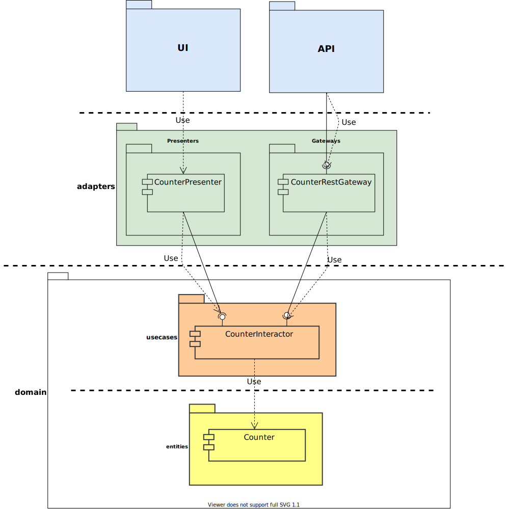

[SOFTSPIDERS](https://github.com/softspiders/softspiders)

# Fullstack Counter App starter on *React* in *TypeScript* that follows *Clean Architecture* principles

Part of the [clean-architecture-counter-starters](https://github.com/softspiders/clean-architecture-counter-starters/blob/master/README.md)

---

## Feature tags
- clean-architecture
- counter-app
- db
- fullstack
- jest
- jest-fetch-mock
- json-server
- react
- react-hooks
- react-testing-library
- rest
- starter
- test-coverage
- typescript
- unit-test

## Parents

[**- db, jest-fetch-mock, rest, react-testing-library, test-coverage, storyshot**](https://github.com/softspiders/clean-architecture-counter-starters/tree/clean-architecture-counter-react-hooks-ts-starter)

---
## Author

[Alexander Lapygin](https://github.com/AlexanderLapygin) <<alexanderlapygin@gmail.com>>

---
## Inspired by

[Eduardo Moroni](https://github.com/eduardomoroni)'s [*react-clean-architecture*](https://github.com/eduardomoroni/react-clean-architecture)

---

<p align="center">
  <a href="https://github.com/softspider">
    
  </a>
  <b>Package structure</b>
</p>

---

## Run

```sh
# API
cd api
npm install
npm start

# App
cd app
npm install
npm start
```

## Test

```sh
cd app
npm run test
```

test with coverage:
```sh
cd app
npm run test:coverage
```

---

## :memo: License
[MIT](./LICENSE)
