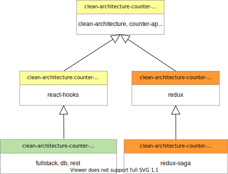

[SOFTSPIDERS](https://github.com/softspiders/softspiders)

# clean-architecture-counter-starters

A set of minimalistic counter-app-starters that follow *Clean Architecture* principles:
- [clean-architecture-counter-react-ts-starter](https://github.com/softspiders/clean-architecture-counter-starters/blob/clean-architecture-counter-react-ts-starter/README.md)
- [clean-architecture-counter-react-hooks-ts-starter](https://github.com/softspiders/clean-architecture-counter-starters/blob/clean-architecture-counter-react-hooks-ts-starter/README.md)
- [clean-architecture-counter-react-hooks-db-ts-starter](https://github.com/softspiders/clean-architecture-counter-starters/blob/clean-architecture-counter-react-hooks-db-ts-starter/README.md)
- [clean-architecture-counter-react-redux-ts-starter](https://github.com/softspiders/clean-architecture-counter-starters/blob/clean-architecture-counter-react-redux-ts-starter/README.md)
- [clean-architecture-counter-react-redux-saga-ts-starter](https://github.com/softspiders/clean-architecture-counter-starters/blob/clean-architecture-counter-react-saga-ts-starter/README.md)

Each starter is on a separate self-titled branch of the repository

UNDER DEVELOPMENT

# Starter Feature Hierarchy

    

